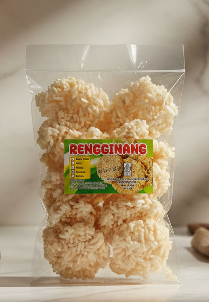

<html lang="id">
<head>
    <meta charset="UTF-8">
    <meta name="viewport" content="width=device-width, initial-scale=1.0">
    <title>UMKM Keren - Katalog Produk</title>
    <link href="https://fonts.googleapis.com/css2?family=Poppins:wght@300;400;600;700&display=swap" rel="stylesheet">
    <link rel="stylesheet" href="https://cdnjs.cloudflare.com/ajax/libs/font-awesome/6.0.0/css/all.min.css">
    
    
</head>
<body>

    <header>
        

            <h1>DUA IKAN</h1>
            
Produk Terbaik & Berkualitas Pilihan Kami

            

                <a href="https://instagram.com/duaikan88" target="_blank" class="social-btn insta">
                    <i class="fab fa-instagram"></i> Instagram
                </a>
                <a href="https://tiktok.com/" target="_blank" class="social-btn tiktok">
                    <i class="fab fa-tiktok"></i> TikTok Shop
                </a>
                <a href="https://shopee.co.id/stephenjapardi" target="_blank" class="social-btn shopee">
                    <i class="fas fa-shopping-bag"></i> Shopee
                </a>
            

        

    </header>

    <main class="container">
        <h2 class="section-title">Katalog Produk</h2>
        
        

            
            

                

                    
                

                

                    <h3>Mie Jumbo</h3>
                    Rp 25.000
                    <button class="btn-buy" onclick="beliViaWA('Mie Jumbo')">
                        <i class="fab fa-whatsapp"></i> Pesan Sekarang
                    </button>
                

            

            

                

                    
                

                

                    <h3>Stik Kentang</h3>
                    Rp 24.000
                    <button class="btn-buy" onclick="beliViaWA('Stik Kentang')">
                        <i class="fab fa-whatsapp"></i> Pesan Sekarang
                    </button>
                

            

            

                

                    
                

                

                    <h3>Banana Crunch</h3>
                    Rp 15.000
                    <button class="btn-buy" onclick="beliViaWA('Banana Crunch')">
                        <i class="fab fa-whatsapp"></i> Pesan Sekarang
                    </button>
                

            

            

                

                    
                

                

                    <h3>Ikan Crispy</h3>
                    Rp 15.000
                    <button class="btn-buy" onclick="beliViaWA('Ikan Crispy')">
                        <i class="fab fa-whatsapp"></i> Pesan Sekarang
                    </button>
                

            

            

                

                    
                

                

                    <h3>Basreng Pedas 200gr</h3>
                    Rp 25.000
                    <button class="btn-buy" onclick="beliViaWA('Basreng Pedas 200gr')">
                        <i class="fab fa-whatsapp"></i> Pesan Sekarang
                    </button>
                

            

            

                

                    
                

                

                    <h3>Jengkol Pedas Kecil</h3>
                    Rp 15.000
                    <button class="btn-buy" onclick="beliViaWA('Jengkol Pedas Kecil')">
                        <i class="fab fa-whatsapp"></i> Pesan Sekarang
                    </button>
                

            

            

                

                    
                

                

                    <h3>Bulat Besar</h3>
                    Rp 24.000
                    <button class="btn-buy" onclick="beliViaWA('Bulat Besar')">
                        <i class="fab fa-whatsapp"></i> Pesan Sekarang
                    </button>
                

            

            

                

                    
                

                

                    <h3>Rangginang</h3>
                    Rp 20.000
                    <button class="btn-buy" onclick="beliViaWA('Rangginang')">
                        <i class="fab fa-whatsapp"></i> Pesan Sekarang
                    </button>
                

            

            

                

                    
                

                

                    <h3>Bangkok Pedas</h3>
                    Rp 23.000
                    <button class="btn-buy" onclick="beliViaWA('Bangkok Pedas')">
                        <i class="fab fa-whatsapp"></i> Pesan Sekarang
                    </button>
                

            

            

                

                    
                

                

                    <h3>Kuping Gajah</h3>
                    Rp 23.000
                    <button class="btn-buy" onclick="beliViaWA('Kuping Gajah')">
                        <i class="fab fa-whatsapp"></i> Pesan Sekarang
                    </button>
                

            

            

                

                    
                

                

                    <h3>Mini Top Pedas</h3>
                    Rp 23.000
                    <button class="btn-buy" onclick="beliViaWA('Mini Top Pedas')">
                        <i class="fab fa-whatsapp"></i> Pesan Sekarang
                    </button>
                

            

            

                

                    
                

                

                    <h3>Mawar Besar</h3>
                    Rp 24.000
                    <button class="btn-buy" onclick="beliViaWA('Mawar Besar')">
                        <i class="fab fa-whatsapp"></i> Pesan Sekarang
                    </button>
                

            

        

    </main>

    <footer>
        
&copy; 2026 Dua Ikan. All Rights Reserved.

        
Dibuat dengan ❤️ UMKM Indonesia

    </footer>

    

    

</body>
</html>
